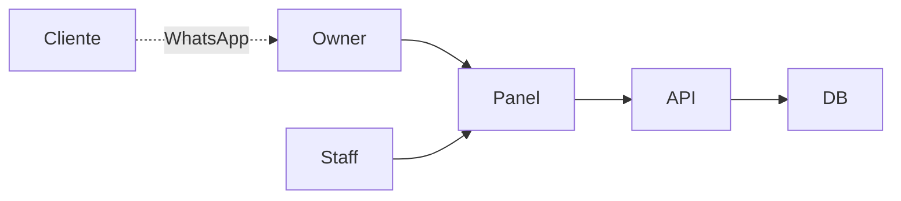

# L04 — Stakeholders y contexto Agenda Ops

**~5.0 h · Semana 1**

Cierras elicitación metiendo contexto en el SRS borrador.

## Objetivo

Rellenar introducción + descripción general del `srs-borrador.md`.

## Pasos

### 1. Lee la plantilla (30 min)

```bash
sed -n '1,80p' projects/m12-srs/plantilla.md
```

### 2. Stakeholders (60 min)

Para Owner, Staff, Cliente final (indirecto): metas, dolores, acceso a datos. Incluye supuesto single-tenant del piloto.

### 3. Contexto (60 min)

Secciones 1.1–1.3 y 2.1–2.3 del borrador. Diagrama:



### 4. Commit (15 min)

```bash
git add projects/m12-srs/srs-borrador.md
git commit -m "docs(m12): l04 contexto stakeholders"
```

## Lectura de esta lección

| Fuente | Qué leer | Enlace |
|--------|----------|--------|
| IEEE 830 adaptada (repo) | Stakeholders owner/staff/cliente; perspectiva del producto piloto | [plantilla SRS](../../../../projects/m12-srs/plantilla.md) |
| Catálogo | Entrada de esta materia | [Bibliografía · M12](../../../bibliografia.md#m12-requerimientos) |


## Hecho cuando

Marca la lección **solo si**:

1. `srs-borrador.md` secciones 1–2 rellenadas (propósito, alcance borrador, stakeholders).
2. Diagrama de contexto (Mermaid o ASCII): actores ↔ Agenda Ops.
3. Commit `docs(m12): l04 contexto stakeholders`.

## Errores comunes

- Olvidar al cliente final (aunque no tenga login en MVP).
- Alcance infinito en la intro.
- Stakeholders sin metas.

## Siguiente

[L05 — Formato user story y trazabilidad](L05-formato-user-story-y-trazabilidad.md)
