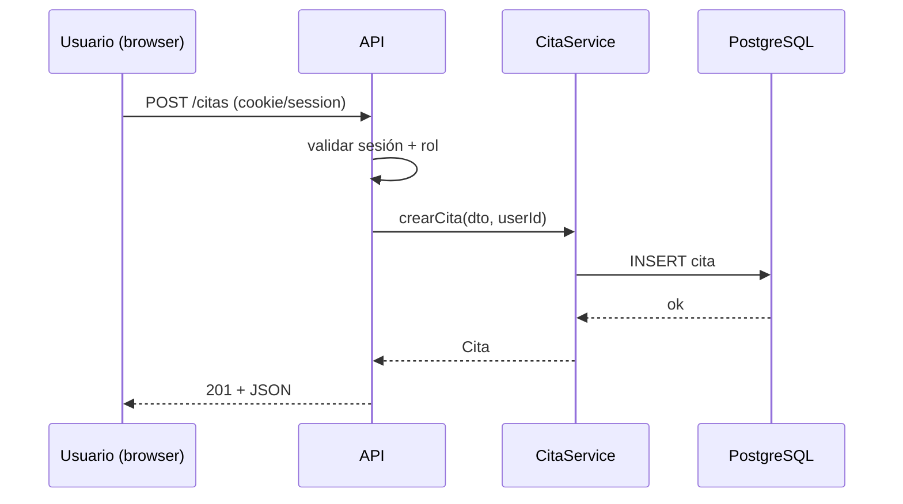

# M13 — Análisis y diseño de software

## Por qué existe

El SRS de Agenda Ops (M12) describe *qué*; esta materia define *cómo* lo estructuras para que M17 no sea un monolito caótico. Marcar **trust boundaries** (navegador, API, base de datos) evita confiar en el cliente HTTP para autorización ([hilo seguridad](../../hilos/seguridad.md)). El paquete de diseño es el mapa que el “yo de M17” seguirá sin reinventar arquitectura cada semana.

**En resumen:** traduces el SRS a diseño usable: flujos, diagramas y ADRs que puedas implementar en el piloto Agenda Ops.


## Objetivos de aprendizaje

Al terminar debes poder:

1. Derivar casos de uso y flujos principales desde `projects/m12-srs/srs-v1.md`.
2. Modelar dominio mínimo (entidades y relaciones) sin UML decorativo.
3. Dibujar diagramas de clases y al menos una secuencia crítica (p. ej. crear cita con auth).
4. Definir arquitectura en capas (HTTP → aplicación → dominio → infraestructura).
5. Documentar trust boundaries y dónde se valida identidad y autorización.
6. Escribir ADRs que defiendan monolito modular frente a microservicios prematuros.
7. Entregar un paquete enlazado en `projects/m13-diseno/` listo para el scaffold M17.

## Cómo estudiar esta materia

- Abre el SRS cada sesión: cada diagrama debe responder a un requisito o RNF concreto.
- Si un diagrama no cambia una decisión, bórralo (regla del plan).
- Usa Mermaid en Markdown dentro del repo; evita herramientas propietarias sin export.
- Relaciona decisiones con [producto-saas.md](../../producto-saas.md) (piloto single-tenant, camino a `tenant_id` documentado, no implementado aún).

## Semana tipo (20 h)

| Bloque | Horas | Qué haces |
|--------|-------|-----------|
| Flujos | 6–8 | Casos de uso + escenarios |
| Diagramas | 6–8 | Clases / secuencia en Mermaid |
| Arquitectura | 4–6 | Capas + trust boundaries + ADR |
| Retro | 1 | Por qué monolito modular ahora |

Si un día solo tienes 2 h: **práctica + proyecto**. La fila de Lecturas de esa semana no se salta.

## Día 1 (2–3 h) — hazlo hoy

1. Crea la carpeta de diseño:
   ```bash
   mkdir -p projects/m13-diseno/diagramas projects/m13-diseno/adr
   ```
2. Lee `projects/m12-srs/srs-v1.md` y lista módulos del piloto: auth, citas, clientes, servicios, admin.
3. Dibuja en `projects/m13-diseno/diagramas/trust-boundaries.md` tres zonas: **navegador** | **API** | **DB**; marca qué datos cruzan cada límite.
4. Escribe `projects/m13-diseno/adr/001-monolito-modular.md`: decisión de monolito modular ahora, no microservicios; consecuencias + revisión futura en M19.
5. Commit: `docs(m13): trust boundaries y ADR 001`.

## Ejemplo — capas y dónde vive la autorización

```text
HTTP controllers  →  application services  →  domain  →  infrastructure (DB, email)
                              ↑
                    autorización y reglas de negocio aquí,
                    no solo ocultando botones en React/Astro
```

## Ejemplo — fragmento Mermaid (secuencia crear cita)



## Temario semanal

### Semana 1 — Del SRS a casos de uso (~20 h)

- Actores: owner, staff, sistema (recordatorios futuros).
- Casos de uso prioritarios alineados al MVP del SRS (login, CRUD citas/clientes, admin roles).
- Escenarios alternos y de error (401, 403, conflicto de horario).
- Entregable: `projects/m13-diseno/casos-de-uso.md`.

### Semana 2 — Modelo y UML práctico (~20 h)

- Diagrama de clases del dominio (solo entidades que implementarás en M17).
- Relaciones y cardinalidades coherentes con M09 (FKs futuras).
- Una secuencia crítica (auth o crear cita) en Mermaid.
- Entregable: `projects/m13-diseno/diagramas/clases.md` + `secuencia-*.md`.

### Semana 3 — Arquitectura en capas (~20 h)

- Separación controller / service / repository (nombres según tu stack).
- DTOs vs entidades; validación en entrada HTTP.
- Diagrama de componentes o contenedores (C4 nivel 1–2, ligero).
- Entregable: `projects/m13-diseno/arquitectura.md` + boundaries actualizados.

### Semana 4 — ADRs y decisiones de diseño (~20 h)

- Plantilla ADR (como M01): contexto, decisión, consecuencias.
- Al menos 2 ADRs: monolito modular + elección de stack o persistencia.
- Nota de extensibilidad: dónde encajará `tenant_id` sin implementarlo.
- Entregable: `projects/m13-diseno/adr/*.md`.

### Semana 5 — Paquete de diseño para M17 (~20 h)

- Índice `projects/m13-diseno/README.md` enlazando SRS, diagramas y ADRs.
- Checklist “listo para scaffold”: rutas API previstas, modelo de datos, flujos Must.
- Repaso con [producto-saas.md](../../producto-saas.md): piloto vs SaaS futuro.
- Pulido y eliminación de diagramas huérfanos.

## Lecturas

Canon: *UML y patrones* — Larman (ed. ES) **o** guía UML en español + ADRs. Apoyo: *Código limpio* (diseño de módulos). Ver [bibliografía](../../bibliografia.md).

| Semana | Capítulos / secciones | Alternativa |
|--------|----------------------|-------------|
| 1 | Casos de uso / escenarios (Larman: requisitos → casos de uso) | Lista de casos desde SRS Agenda Ops |
| 2 | **UML práctico**: clases, secuencia (solo lo que usarás) | Diagramas Mermaid en `projects/m13-diseno/` |
| 3 | Arquitectura en **capas** + trust boundaries | `trust-boundaries.md` + `arquitectura.md` |
| 4 | **ADRs** (plantilla M01) — 2+ decisiones de diseño | `projects/m13-diseno/adr/` |
| 5 | Integración del paquete + [producto-saas.md](../../producto-saas.md) | Índice README del proyecto M13 |

**Regla:** cada diagrama debe usarse en una decisión; si no se usa, bórralo.

## Prácticas

1. **P1 — Flujos:** `projects/m13-diseno/casos-de-uso.md` con flujos principales del piloto Agenda Ops.
2. **P2 — UML:** Diagrama de clases + al menos una secuencia crítica en `projects/m13-diseno/diagramas/`.
3. **P3 — Boundaries:** `projects/m13-diseno/diagramas/trust-boundaries.md` con límites y notas de amenaza (alto nivel).

## Proyecto útil

**Paquete de diseño Agenda Ops:** todo en `projects/m13-diseno/`:

- Enlace explícito a `projects/m12-srs/srs-v1.md`.
- Diagramas + ADRs + arquitectura en capas.
- Lista de endpoints o módulos previstos para M17 (aunque aún no exista código).

## Errores comunes

- Microservicios prematuros “porque es lo moderno”.
- Diagramas que nadie lee y no coinciden con el SRS.
- Confiar en el front para autorización (ocultar rutas sin chequeo en API).
- Modelar 40 entidades el día 1; mejor las del MVP Must.
- ADRs genéricos copiados sin contexto de Agenda Ops.

## Evidencia de hecho

Marca la práctica en la UI solo si existe **esto** (o equivalente claro):

- **P1 — Flujos:** `projects/m13-diseno/casos-de-uso.md` cubriendo historias Must del SRS.
- **P2 — UML:** `projects/m13-diseno/diagramas/clases.md` + `diagramas/secuencia-*.md`.
- **P3 — Boundaries:** `projects/m13-diseno/diagramas/trust-boundaries.md` actualizado.
- **Proyecto — Paquete:** `projects/m13-diseno/README.md` índice + ADRs en `projects/m13-diseno/adr/`.

## Criterios de dominio

- [ ] Defiendes monolito modular con trade-offs frente a microservicios.
- [ ] Trust boundaries están en el diagrama y sabes dónde se valida el rol.
- [ ] Un compañero puede empezar M17 solo con SRS + paquete M13.
- [ ] No quedan diagramas sin trazabilidad a un requisito del SRS.
