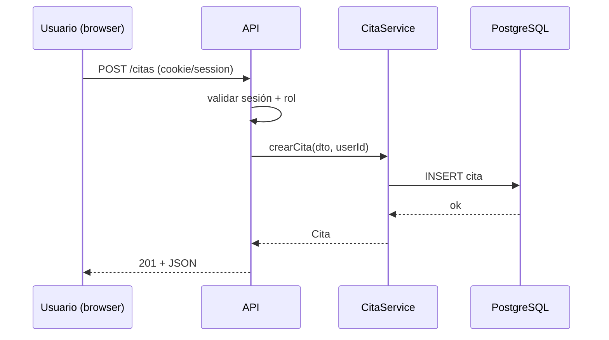

# M13 — Análisis y diseño de software

## Por qué existe

El SRS de Agenda Ops (M12) describe *qué*; esta materia define *cómo* lo estructuras para que M17 no sea un monolito caótico. Marcar **trust boundaries** (navegador, API, base de datos) evita confiar en el cliente HTTP para autorización ([hilo seguridad](../../hilos/seguridad.md)). El paquete de diseño es el mapa que el “yo de M17” seguirá sin reinventar arquitectura cada semana.

**En resumen:** traduces el SRS a diseño usable: flujos, diagramas y ADRs que puedas implementar en el piloto Agenda Ops.


## Objetivos de aprendizaje

Al terminar debes poder:

1. Derivar casos de uso y flujos principales desde `projects/m12-srs/srs-v1.md`.
2. Modelar dominio mínimo (entidades y relaciones) sin UML decorativo.
3. Dibujar diagramas de clases y al menos una secuencia crítica (p. ej. crear cita con auth).
4. Definir arquitectura en capas (HTTP → aplicación → dominio → infraestructura).
5. Documentar trust boundaries y dónde se valida identidad y autorización.
6. Escribir ADRs que defiendan monolito modular frente a microservicios prematuros.
7. Entregar un paquete enlazado en `projects/m13-diseno/` listo para el scaffold M17.

## Cómo estudiar esta materia (lecciones)

M13 traduce el SRS de **Agenda Ops** a diseño implementable: L01–L20.

1. Abre `projects/m12-srs/srs-v1.md` cada sesión.
2. Si un diagrama no cambia una decisión, bórralo.
3. Mermaid en Markdown dentro del repo.
4. Marca lecciones al cumplir “Hecho cuando” en `projects/m13-diseno/`.
5. [Cómo estudiar](../../como-estudiar.md).

## Semana tipo (20 h)

| Bloque | Horas | Qué haces |
|--------|-------|-----------|
| Flujos / diagramas | 10–12 | 4 lecciones de la semana |
| Arquitectura + ADRs | 6–8 | Capas, boundaries, decisiones |
| Retro | 1 | Por qué monolito modular ahora |

Si un día solo tienes 2 h: **una lección** con artefacto en git.

## Lecciones

### Semana 1 — Del SRS a casos de uso (~20 h)

| ID | Lección | ~h |
|----|---------|-----|
| L01 | [Trust boundaries y ADR 001](M13/L01-trust-boundaries-y-adr-001.md) | 5 |
| L02 | [Actores y casos de uso prioritarios](M13/L02-actores-y-casos-de-uso-prioritarios.md) | 5 |
| L03 | [Escenarios alternos y errores](M13/L03-escenarios-alternos-y-errores.md) | 5 |
| L04 | [Cierre P1 flujos principales](M13/L04-cierre-p1-flujos-principales.md) | 5 |

### Semana 2 — Modelo y UML práctico (~20 h)

| ID | Lección | ~h |
|----|---------|-----|
| L05 | [Diagrama de clases del dominio](M13/L05-diagrama-de-clases-del-dominio.md) | 5 |
| L06 | [Cardinalidades y persistencia futura](M13/L06-cardinalidades-y-persistencia-futura.md) | 5 |
| L07 | [Secuencia: autenticación y sesión](M13/L07-secuencia-autenticacion-y-sesion.md) | 5 |
| L08 | [Secuencia: crear cita (P2)](M13/L08-secuencia-crear-cita-p2.md) | 5 |

### Semana 3 — Arquitectura en capas (~20 h)

| ID | Lección | ~h |
|----|---------|-----|
| L09 | [Arquitectura en capas](M13/L09-arquitectura-en-capas.md) | 5 |
| L10 | [DTOs, validación y frontera HTTP](M13/L10-dtos-validacion-y-frontera-http.md) | 5 |
| L11 | [Componentes y despliegue (C4 ligero)](M13/L11-componentes-y-despliegue-c4-ligero.md) | 5 |
| L12 | [Boundaries actualizados y amenazas](M13/L12-boundaries-actualizados-y-amenazas.md) | 5 |

### Semana 4 — ADRs de diseño (~20 h)

| ID | Lección | ~h |
|----|---------|-----|
| L13 | [Plantilla ADR y decisiones de diseño](M13/L13-plantilla-adr-y-decisiones-de-diseno.md) | 5 |
| L14 | [ADR persistencia y modelo de datos](M13/L14-adr-persistencia-y-modelo-de-datos.md) | 5 |
| L15 | [Extensibilidad tenant_id sin implementar](M13/L15-extensibilidad-tenant-id-sin-implementar.md) | 5 |
| L16 | [ADR auth y sesión](M13/L16-adr-auth-y-sesion.md) | 5 |

### Semana 5 — Paquete para M17 (~20 h)

| ID | Lección | ~h |
|----|---------|-----|
| L17 | [Índice del paquete de diseño](M13/L17-indice-del-paquete-de-diseno.md) | 5 |
| L18 | [Endpoints y módulos previstos M17](M13/L18-endpoints-y-modulos-previstos-m17.md) | 5 |
| L19 | [Checklist listo para scaffold](M13/L19-checklist-listo-para-scaffold.md) | 5 |
| L20 | [Cierre M13 — trazabilidad y dominio](M13/L20-cierre-m13-trazabilidad-y-dominio.md) | 5 |

Empieza por **L01** hoy.

## Lecturas (mapa rápido)

Canon: *UML y patrones* — Larman (ed. ES) **o** guía UML en español + ADRs. Apoyo: *Código limpio* (módulos). Ver [bibliografía](../../bibliografia.md).

| Semana | Lecciones | Capítulos / secciones | Alternativa |
|--------|-----------|----------------------|-------------|
| 1 | L01–L04 | Casos de uso desde SRS Agenda Ops | `casos-de-uso.md` |
| 2 | L05–L08 | UML clases y secuencia | Mermaid en `diagramas/` |
| 3 | L09–L12 | Capas + trust boundaries | `arquitectura.md` |
| 4 | L13–L16 | ADRs (plantilla M01) | `projects/m13-diseno/adr/` |
| 5 | L17–L20 | Paquete + [producto-saas.md](../../producto-saas.md) | README índice M13 |

**Regla:** cada diagrama debe trazarse a un requisito del SRS.


## Ejemplo — capas y dónde vive la autorización

```text
HTTP controllers  →  application services  →  domain  →  infrastructure (DB, email)
                              ↑
                    autorización y reglas de negocio aquí,
                    no solo ocultando botones en React/Astro
```

## Ejemplo — fragmento Mermaid (secuencia crear cita)



## Temario semanal

### Semana 1 — Del SRS a casos de uso (~20 h)

- Actores: owner, staff, sistema (recordatorios futuros).
- Casos de uso prioritarios alineados al MVP del SRS (login, CRUD citas/clientes, admin roles).
- Escenarios alternos y de error (401, 403, conflicto de horario).
- Entregable: `projects/m13-diseno/casos-de-uso.md`.

### Semana 2 — Modelo y UML práctico (~20 h)

- Diagrama de clases del dominio (solo entidades que implementarás en M17).
- Relaciones y cardinalidades coherentes con M09 (FKs futuras).
- Una secuencia crítica (auth o crear cita) en Mermaid.
- Entregable: `projects/m13-diseno/diagramas/clases.md` + `secuencia-*.md`.

### Semana 3 — Arquitectura en capas (~20 h)

- Separación controller / service / repository (nombres según tu stack).
- DTOs vs entidades; validación en entrada HTTP.
- Diagrama de componentes o contenedores (C4 nivel 1–2, ligero).
- Entregable: `projects/m13-diseno/arquitectura.md` + boundaries actualizados.

### Semana 4 — ADRs y decisiones de diseño (~20 h)

- Plantilla ADR (como M01): contexto, decisión, consecuencias.
- Al menos 2 ADRs: monolito modular + elección de stack o persistencia.
- Nota de extensibilidad: dónde encajará `tenant_id` sin implementarlo.
- Entregable: `projects/m13-diseno/adr/*.md`.

### Semana 5 — Paquete de diseño para M17 (~20 h)

- Índice `projects/m13-diseno/README.md` enlazando SRS, diagramas y ADRs.
- Checklist “listo para scaffold”: rutas API previstas, modelo de datos, flujos Must.
- Repaso con [producto-saas.md](../../producto-saas.md): piloto vs SaaS futuro.
- Pulido y eliminación de diagramas huérfanos.


## Prácticas

1. **P1 — Flujos:** `projects/m13-diseno/casos-de-uso.md` con flujos principales del piloto Agenda Ops.
2. **P2 — UML:** Diagrama de clases + al menos una secuencia crítica en `projects/m13-diseno/diagramas/`.
3. **P3 — Boundaries:** `projects/m13-diseno/diagramas/trust-boundaries.md` con límites y notas de amenaza (alto nivel).

## Proyecto útil

**Paquete de diseño Agenda Ops:** todo en `projects/m13-diseno/`:

- Enlace explícito a `projects/m12-srs/srs-v1.md`.
- Diagramas + ADRs + arquitectura en capas.
- Lista de endpoints o módulos previstos para M17 (aunque aún no exista código).

## Errores comunes

- Microservicios prematuros “porque es lo moderno”.
- Diagramas que nadie lee y no coinciden con el SRS.
- Confiar en el front para autorización (ocultar rutas sin chequeo en API).
- Modelar 40 entidades el día 1; mejor las del MVP Must.
- ADRs genéricos copiados sin contexto de Agenda Ops.

## Evidencia de hecho

Marca la práctica en la UI solo si existe **esto** (o equivalente claro):

- **P1 — Flujos:** `projects/m13-diseno/casos-de-uso.md` cubriendo historias Must del SRS.
- **P2 — UML:** `projects/m13-diseno/diagramas/clases.md` + `diagramas/secuencia-*.md`.
- **P3 — Boundaries:** `projects/m13-diseno/diagramas/trust-boundaries.md` actualizado.
- **Proyecto — Paquete:** `projects/m13-diseno/README.md` índice + ADRs en `projects/m13-diseno/adr/`.

## Criterios de dominio

- [ ] Defiendes monolito modular con trade-offs frente a microservicios.
- [ ] Trust boundaries están en el diagrama y sabes dónde se valida el rol.
- [ ] Un compañero puede empezar M17 solo con SRS + paquete M13.
- [ ] No quedan diagramas sin trazabilidad a un requisito del SRS.
