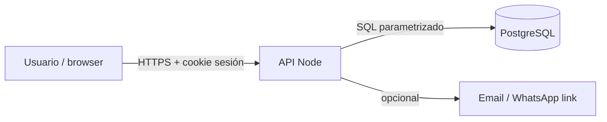

# L01 — Trust boundaries y ADR 001

**~5.0 h · Semana 1**

El SRS de Vitrina dice *qué*; hoy marcas *dónde* deja de confiarse el sistema y decides monolito modular antes de dibujar 40 cajas.

## Objetivo

Dejar `projects/m13-diseno/` con trust boundaries dibujados y el ADR 001 (monolito modular) firmado en git.

## Por qué empieza así

Autorización no vive solo ocultando botones en el panel. Si no marcas el límite navegador→API→DB, M17 nacerá confiando en el cliente HTTP.

## Pasos (hazlos en orden)

### 1. Revisa scaffold y SRS (25–35 min)

```bash
ls projects/m13-diseno
cat projects/m13-diseno/README.md
ls projects/m12-srs
```

Si aún no tienes `projects/m12-srs/srs-v1.md`, usa `projects/m12-srs/plantilla.md` + [producto-saas.md](../../../producto-saas.md) (pedidos, clientes, owner/staff). Anota 3 requisitos Must que toquen auth o datos ajenos.

### 2. Crea carpetas (10 min)

```bash
mkdir -p projects/m13-diseno/diagramas projects/m13-diseno/adr
```

### 3. Dibuja trust boundaries (70–90 min)

Crea `projects/m13-diseno/diagramas/trust-boundaries.md` con título, el diagrama siguiente, tablas y notas.

Diagrama (cópialo al archivo):



Tabla **Qué cruza cada límite**:

| Límite | Datos / credenciales | Quién valida |
|--------|----------------------|--------------|
| Browser → API | Cookie de sesión, JSON de pedido | API: sesión + rol |
| API → DB | user_id, cliente_id, slot | API + constraints DB |
| API → Mail | email, texto sin PII extra | API (no el browser) |

**Nota de amenaza (alto nivel):** cookie robada → sesión hijack (HttpOnly, Secure, SameSite); IDOR `GET /pedidos/:id` de otro negocio → 403 en API, no solo en UI.

Ajusta nombres a tu SRS; no inventes microservicios.

### 4. Escribe ADR 001 (60–75 min)

Crea `projects/m13-diseno/adr/001-monolito-modular.md` siguiendo la plantilla de M01:

```markdown
# ADR 001 — Monolito modular para el piloto Vitrina

## Contexto
Un design partner, un deploy, equipo de uno. Necesito auth + pedidos + clientes
sin ops de N servicios.

## Decisión
Monolito modular: un proceso API + un front, módulos internos
(auth, pedidos, clientes) con fronteras claras de código.

## Consecuencias
+ Deploy simple; traces end-to-end fáciles
+ Transacciones locales (crear pedido) sin saga
− Riesgo de “ball of mud” si no cuidamos capas (mitigar en M13 L09+)
− Multi-tenant real llega después (tenant_id en M15/M17 path)
```

### 5. Commit (15 min)

```bash
git add projects/m13-diseno
git status
git commit -m "docs(m13): trust boundaries y ADR 001 monolito modular"
```

## Lectura de esta lección

| Fuente | Qué leer | Enlace |
|--------|----------|--------|
| *UML y patrones* — Larman (ed. ES) | Límites de confianza en apps web; plantilla ADR (contexto → decisión → consecuencias) | [OWASP — Trust Boundaries (glosario)](https://owasp.org/www-community/vulnerabilities/Trust_Boundary_Violation) |
| Catálogo | Entrada de esta materia | [Bibliografía · M13](../../../bibliografia.md#m13-analisis-y-diseno) |


## Hecho cuando

Marca la lección **solo si**:

1. Existe `projects/m13-diseno/diagramas/trust-boundaries.md` con Mermaid (navegador | API | DB) y datos que cruzan cada límite.
2. Existe `projects/m13-diseno/adr/001-monolito-modular.md` con contexto Vitrina, decisión y ≥3 consecuencias.
3. Commit `docs(m13): trust boundaries y ADR 001 monolito modular`.

## Errores comunes

- Dibujar microservicios “porque es moderno” sin problema que lo justifique.
- Boundary sin listar qué dato o credencial cruza (cookie, JSON, SQL).
- ADR genérico copiado sin mencionar pedidos/clientes/roles del piloto.

## Siguiente

[L02 — Actores y casos de uso prioritarios](L02-actores-y-casos-de-uso-prioritarios.md)
