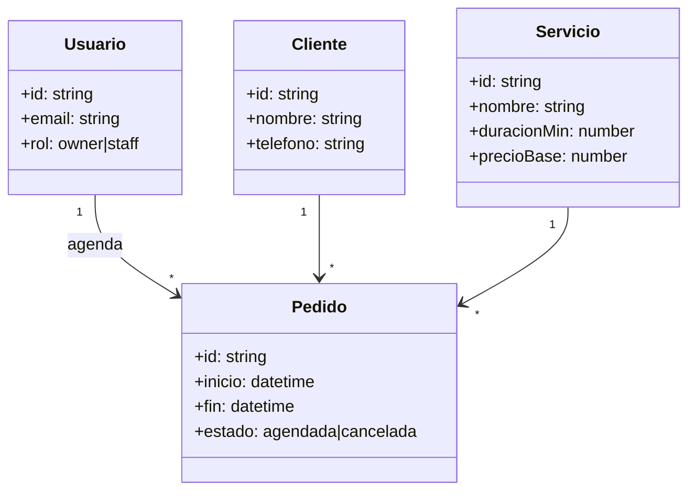

# L05 — Diagrama de clases del dominio

**~5.0 h · Semana 2**

Traduces UC a cosas que existen: Cliente, Servicio, Pedido, Usuario. Sin UML decorativo.

## Objetivo

`projects/m13-diseno/diagramas/clases.md` con dominio mínimo alineado al SRS y a M09.

## Pasos (hazlos en orden)

### 1. Lista entidades Must (30–40 min)

Desde `casos-de-uso.md` y, si existe, `projects/m09-bases-datos/er-vitrina.md`:

- Usuario (rol owner/staff)
- Cliente
- Servicio
- Pedido
- (Opcional) Negocio stub si ya pensaste single-tenant explícito

### 2. Escribe el Mermaid (70–90 min)

En `diagramas/clases.md` incluye este diagrama (ajústalo a tu SRS):



Añade una tabla **Trazabilidad** (clase → UC / historia). Ejemplo: `Pedido` → UC-03, UC-04.

### 3. Atributos honestos (40 min)

Borra getters UML vacíos. Si no sabes el tipo, anótalo en una lista “decidir en L14” — no inventes 12 enums.

### 4. Commit (15 min)

```bash
git add projects/m13-diseno/diagramas/clases.md
git commit -m "docs(m13): diagrama de clases del dominio"
```

## Lectura de esta lección

| Fuente | Qué leer | Enlace |
|--------|----------|--------|
| *UML y patrones* — Larman (ed. ES) | Modelo de dominio: clases, atributos y asociaciones mínimas | [Mermaid — classDiagram](https://mermaid.js.org/syntax/classDiagram.html) |
| Catálogo | Entrada de esta materia | [Bibliografía · M13](../../../bibliografia.md#m13-analisis-y-diseno) |


## Hecho cuando

Marca la lección **solo si**:

1. `diagramas/clases.md` incluye Mermaid con ≥4 clases del MVP (p. ej. Usuario, Cliente, Servicio, Pedido).
2. Cada clase tiene atributos que implementarás en M17 (no “campos por estética”).
3. Commit `docs(m13): diagrama de clases del dominio`.

## Errores comunes

- 40 clases el día 1 (Factura, Inventario, CRM…).
- Modelar pantallas React como clases de dominio.
- Olvidar `negocioId`/`userId` donde el SRS implica pertenencia.

## Siguiente

[L06 — Cardinalidades y persistencia futura](L06-cardinalidades-y-persistencia-futura.md)
