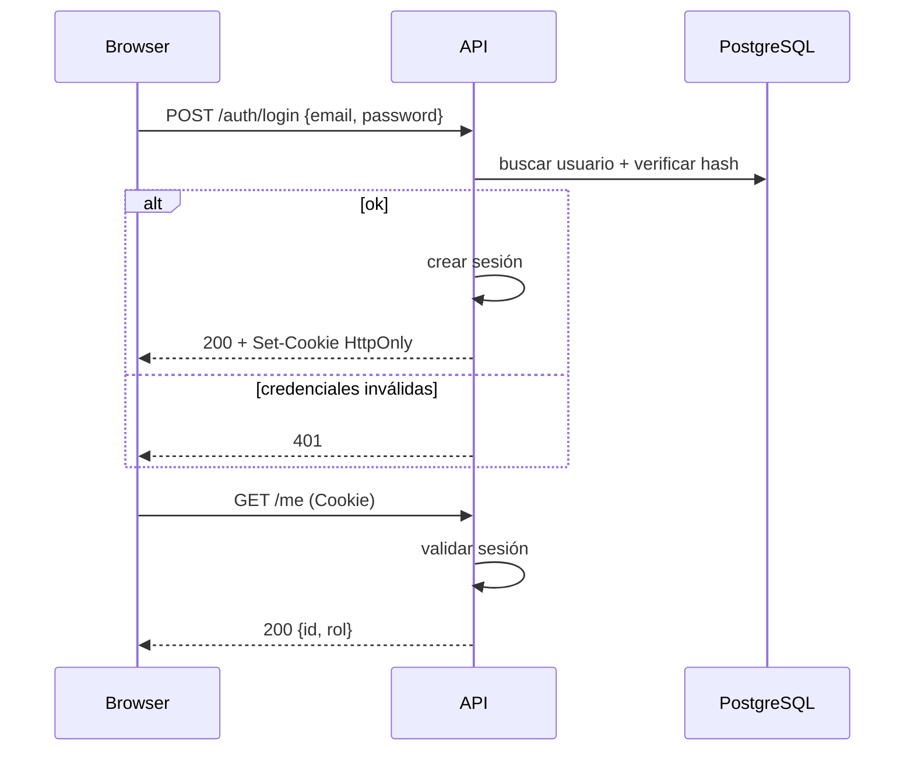

# L07 — Secuencia: autenticación y sesión

**~5.0 h · Semana 2**

Sin una secuencia de auth, el resto de diagramas asume magia. Hoy dibujas login y validación de sesión.

## Objetivo

`diagramas/secuencia-auth.md` con Mermaid del flujo UC-01.

## Pasos (hazlos en orden)

### 1. Decide mecanismo (20–30 min)

Piloto recomendado: **sesión server-side o cookie firmada HttpOnly**. Anótalo; el ADR formal es L16.

### 2. Secuencia feliz + fallo (80–100 min)

En `diagramas/secuencia-auth.md`:



### 3. Notas de seguridad (40 min)

Lista bajo el diagrama: password hasheado (nunca en logs), rate limit futuro, no revelar “email no existe” vs “password mal” si tu amenaza lo pide (o documenta el trade-off UX).

### 4. Commit (15 min)

```bash
git add projects/m13-diseno/diagramas/secuencia-auth.md
git commit -m "docs(m13): secuencia autenticacion y sesion"
```

## Lectura de esta lección

| Fuente | Qué leer | Enlace |
|--------|----------|--------|
| *UML y patrones* — Larman (ed. ES) | Secuencia UML: login, cookie/sesión, fallo 401 | [Mermaid — sequenceDiagram](https://mermaid.js.org/syntax/sequenceDiagram.html) |
| Catálogo | Entrada de esta materia | [Bibliografía · M13](../../../bibliografia.md#m13-analisis-y-diseno) |


## Hecho cuando

Marca la lección **solo si**:

1. `secuencia-auth.md` muestra participantes Browser, API, Store/DB y pasos de login OK + fallo.
2. Queda explícito dónde se crea/valida la sesión (API, no solo front).
3. Commit `docs(m13): secuencia autenticacion y sesion`.

## Errores comunes

- Secuencia donde el browser “guarda el rol” y la API confía ciegamente.
- Olvidar el camino de credenciales inválidas.
- Tokens en localStorage sin justificación (si eliges cookie, dilo en el diagrama).

## Siguiente

[L08 — Secuencia: crear pedido (P2)](L08-secuencia-crear-pedido-p2.md)
