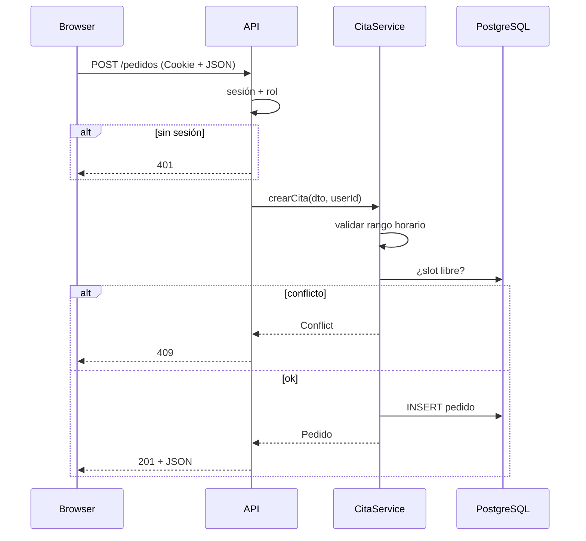

# L08 — Secuencia: crear pedido (P2)

**~5.0 h · Semana 2**

P2 pide clases + secuencia crítica. Hoy cierras con el corazón del piloto: **crear pedido**.

## Objetivo

`diagramas/secuencia-crear-pedido.md` alineada a UC-03 y a los errores de L03.

## Pasos (hazlos en orden)

### 1. Borrador Mermaid (80–100 min)



### 2. Alinea con clases y casos (40–50 min)

- Nombres de métodos ≈ lo que pondrás en M14/M17 (`CitaService`).
- Actualiza `casos-de-uso.md` si descubriste un alterno nuevo.

### 3. Checklist P2 (20 min)

- [ ] `diagramas/clases.md`
- [ ] `diagramas/secuencia-*.md` (≥1 crítica)

### 4. Commit (15 min)

```bash
git add projects/m13-diseno/diagramas
git commit -m "docs(m13): secuencia crear pedido y cierre P2"
```

## Lectura de esta lección

| Fuente | Qué leer | Enlace |
|--------|----------|--------|
| *UML y patrones* — Larman (ed. ES) | Secuencia crítica crear pedido; authz en API | [C4 model (apoyo diagramas)](https://c4model.com/) |
| Catálogo | Entrada de esta materia | [Bibliografía · M13](../../../bibliografia.md#m13-analisis-y-diseno) |


## Hecho cuando

Marca la lección **solo si**:

1. `secuencia-crear-pedido.md` incluye validación de sesión/rol, reglas de dominio e INSERT.
2. P2 completo: `clases.md` + al menos una secuencia crítica en `diagramas/`.
3. Commit `docs(m13): secuencia crear pedido y cierre P2`.

## Errores comunes

- API inserta sin chequear sesión.
- Conflicto de horario ausente en la secuencia.
- Marcar P2 sin archivo de secuencia en git.

## Siguiente

[L09 — Arquitectura en capas](L09-arquitectura-en-capas.md)
