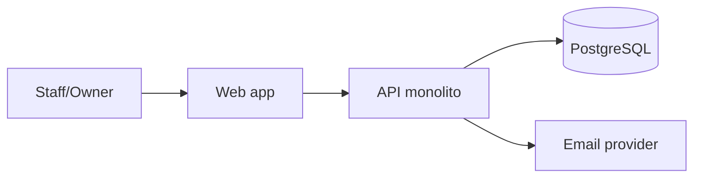

# L11 — Componentes y despliegue (C4 ligero)

**~5.0 h · Semana 3**

Zoom out: no clases, sino cajas desplegables. Suficiente para M19 sin teatro enterprise.

## Objetivo

`diagramas/c4-contenedores.md` con contexto + contenedores del piloto.

## Pasos (hazlos en orden)

### 1. Contexto (40–50 min)

Personas: Owner/Staff. Sistema: Vitrina. Externos: Email o WhatsApp link, (luego) Stripe.

### 2. Contenedores (60–70 min)



Notas de deploy tentativas: un VPS o PaaS, un proceso Node, un Postgres (Docker ok en local).

### 3. Qué NO dibujas (20 min)

Sin service mesh, sin cola Kafka “por si acaso”. Si el SRS no lo pide, fuera.

### 4. Commit (15 min)

```bash
git add projects/m13-diseno/diagramas/c4-contenedores.md
git commit -m "docs(m13): C4 ligero contexto y contenedores"
```

## Lectura de esta lección

| Fuente | Qué leer | Enlace |
|--------|----------|--------|
| *UML y patrones* — Larman (ed. ES) | C4 context/container para un monolito web + DB | [C4 model](https://c4model.com/) |
| Catálogo | Entrada de esta materia | [Bibliografía · M13](../../../bibliografia.md#m13-analisis-y-diseno) |


## Hecho cuando

Marca la lección **solo si**:

1. Diagrama de contexto (persona + Vitrina + sistemas externos).
2. Diagrama de contenedores: Web, API, PostgreSQL (± email).
3. Commit `docs(m13): C4 ligero contexto y contenedores`.

## Errores comunes

- C4 con 25 microservicios inventados.
- Olvidar al design partner / usuario del negocio como persona.
- Mezclar nivel clases con nivel contenedores en un solo dibujo ilegible.

## Siguiente

[L12 — Boundaries actualizados y amenazas](L12-boundaries-actualizados-y-amenazas.md)
