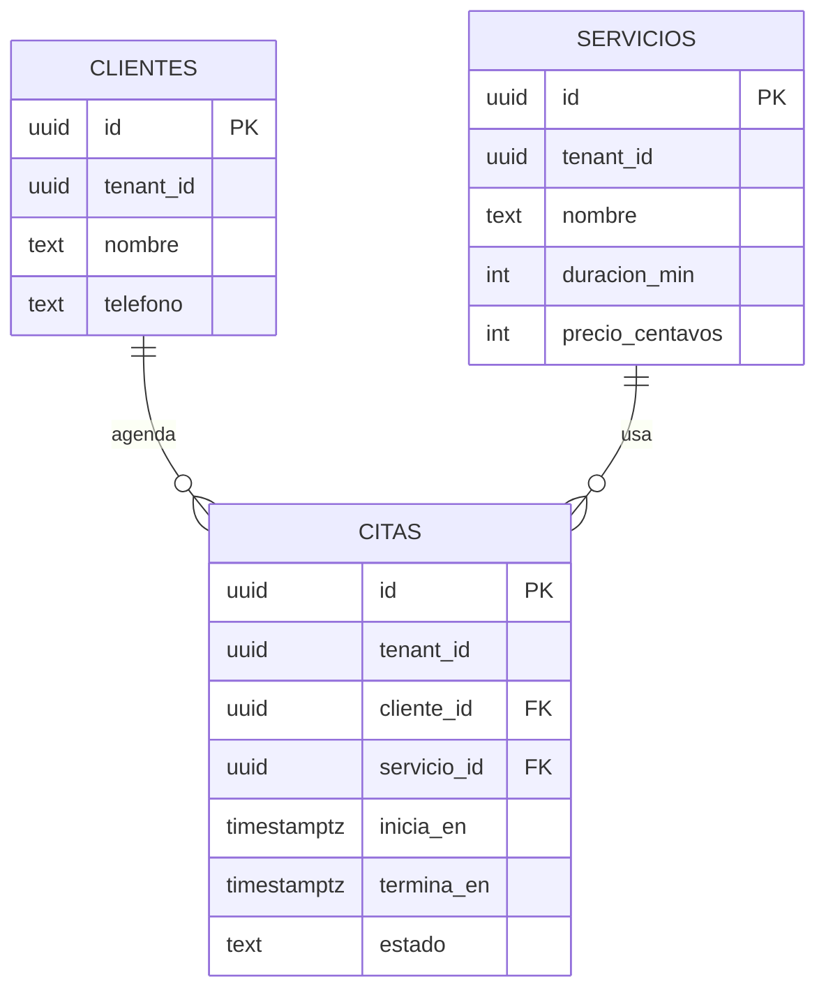

# ER — Agenda Ops (M09)

## Dominio (1 párrafo)

SaaS de citas para un negocio de servicios locales (barbería / consultorio). En M09 modelamos **un** tenant; dejamos `tenant_id` listo para M17.

## Entidades

| Entidad | Atributos clave | Notas |
|---------|-----------------|-------|
| Cliente | id, nombre, telefono, email, notas | Una persona que agenda |
| Servicio | id, nombre, duracion_min, precio_centavos, activo | Catálogo del negocio |
| Cita | id, cliente_id, servicio_id, inicia_en, termina_en, estado | Hecho central |

## Diagrama (Mermaid)

## Cardinalidades y reglas

- Un cliente tiene 0..N citas.
- Un servicio aparece en 0..N citas.
- Una cita pertenece a **un** cliente y **un** servicio (MVP).
- `termina_en > inicia_en`.
- Estados: `programada | confirmada | completada | cancelada | no_show`.

## Normalización

| Forma | ¿Cumple? | Evidencia / decisión |
|-------|----------|----------------------|
| 1FN | | (L05) |
| 2FN | | (L06) |
| 3FN | | (L07) |

## Desnormalización consciente (L08)

Documenta aquí si materializas algún campo (ej. snapshot de precio) y por qué.
