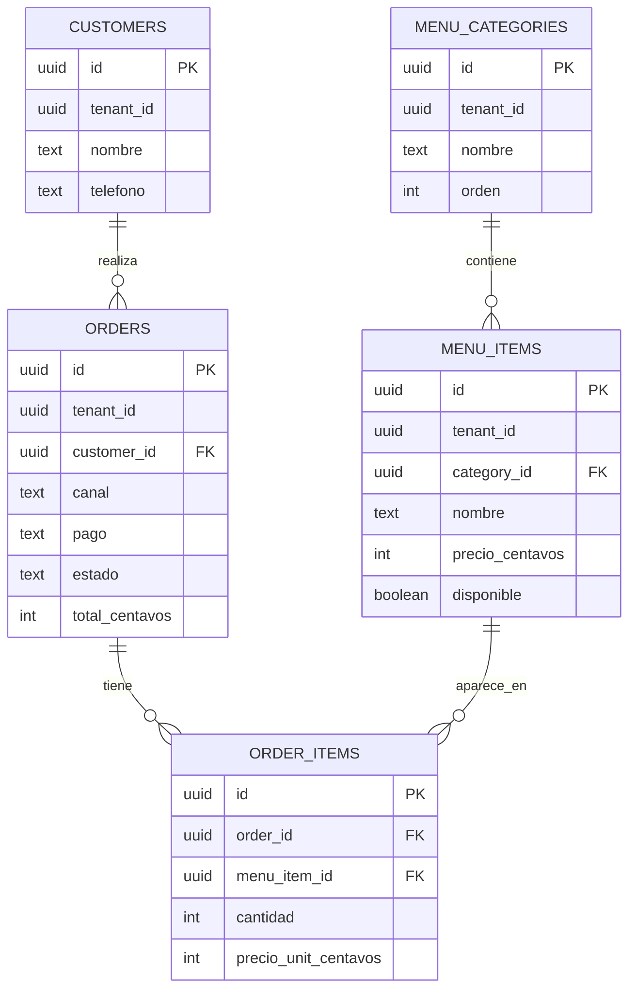

# ER — Vitrina (M09)

## Dominio (1 párrafo)

SaaS de **menú + pedidos** para un local QSR o barra de bebidas (café, boba, matcha, etc.). En M09 modelamos **un** tenant; dejamos `tenant_id` listo para M17.

## Entidades

| Entidad | Atributos clave | Notas |
|---------|-----------------|-------|
| MenuCategory | id, nombre, orden, activo | Agrupa ítems del menú |
| MenuItem | id, category_id, nombre, precio_centavos, disponible | Producto principal del SaaS |
| Customer | id, nombre, telefono | Quien pide (mínimo WhatsApp) |
| Order | id, customer_id, canal, pago, estado, total_centavos | Pedido (WA u online) |
| OrderItem | id, order_id, menu_item_id, cantidad, precio_unit, nombre_snapshot | Líneas del pedido |

## Diagrama (Mermaid)

## Cardinalidades y reglas

- Una categoría tiene 0..N ítems.
- Un pedido tiene 1..N líneas (`order_items`).
- `canal`: `whatsapp` | `online`; `pago`: `al_recoger` | `online`.
- Estados de pedido: `recibido | preparando | listo | entregado | cancelado`.
- Snapshot de nombre/precio en `order_items` (el menú puede cambiar después).

## Normalización

| Forma | ¿Cumple? | Evidencia / decisión |
|-------|----------|----------------------|
| 1FN | | (L05) |
| 2FN | | (L06) |
| 3FN | | (L07) |

## Desnormalización consciente (L08)

Documenta el snapshot de precio/nombre en `order_items` y por qué no lees siempre `menu_items` al historial.
