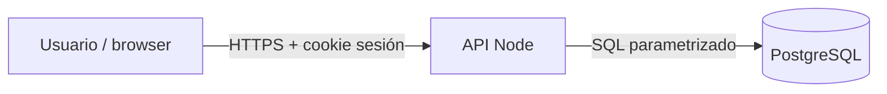

# Trust boundaries — Agenda Ops (piloto)

Completa en **L01** (y actualiza en **L12**).

## Diagrama

## Qué cruza cada límite

| Límite | Datos / credenciales | Quién valida |
|--------|----------------------|--------------|
| Browser → API | | |
| API → DB | | |

## Nota de amenaza (alto nivel)

- 
